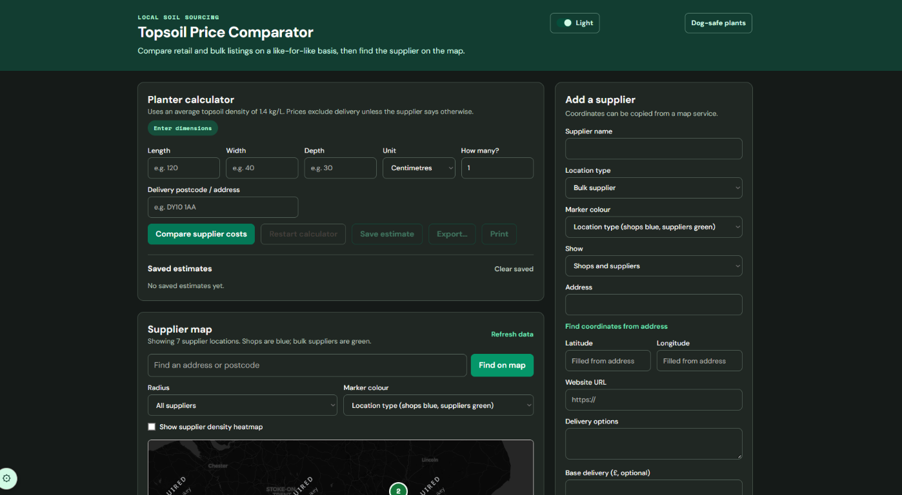
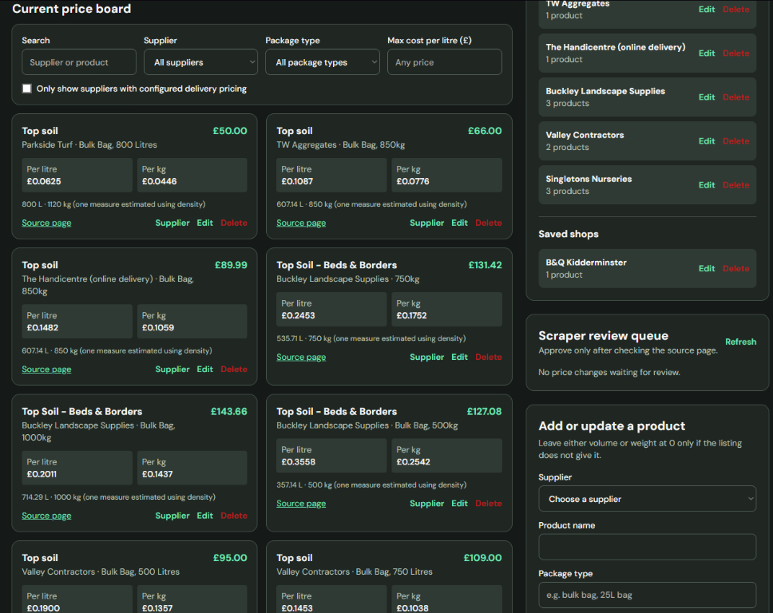

#  Topsoil Price Comparator

Compare bulk and retail topsoil listings on a like-for-like basis (per litre / per kg),
work out how much you need with a planter calculator, and find the nearest supplier on a map.


[](https://28riptide12.github.io/Portfolio/projects/self-host-topsoil-price-comparator.html)
[](https://topsoil-price-comparator.onrender.com)

**Hosted on Render's free tier, so the first load after inactivity may take ~30s to wake up.**


## Features

- **Like-for-like pricing** — every listing is normalised to price-per-litre and price-per-kg so a
  20L bag and an 800L bulk bag are actually comparable.
- **Planter calculator** — enter length, width, and depth (any unit) to work out exactly how much
  soil you need, with an average topsoil density baked in.
- **Supplier map** — plots every supplier by postcode/address, with radius search and a density
  heatmap toggle.
- **Delivery-aware filtering** — filter to only suppliers with configured delivery pricing.
- **Review-first price scraping** — `scrape_prices.py` stages new prices for manual review before
  anything touches the live price board, so nothing gets published unchecked.
- **CSV export & edit history** — export the price board and undo/redo imports from a history log.



## Tech stack

Flask · vanilla JS + Tailwind (CDN) · a local JSON "database" (no external DB required) ·
BeautifulSoup for scraping · Leaflet-style map tiles.

## Quick start

```powershell
pip install -r requirements.txt
flask --app app run --debug
```

Open `http://127.0.0.1:5000/`.

## Routes

| Route | Purpose |
|---|---|
| `/` | Main comparator UI |
| `/api/suppliers*` | Supplier CRUD + geocoding |
| `/api/calculate` | Planter volume/weight calculator |
| `/api/geocode` | Address → coordinates lookup |
| `/api/pending-updates*` | Review queue for scraped prices |
| `/docs` | In-app documentation |

## Data files

All "database" state is plain JSON under `database/` — easy to inspect, back up, or reset:

- `database/suppliers.json` – seeded supplier & product catalogue
- `database/scrape_targets.json` – seeded scraping configuration
- `database/pending_updates.json` – empty review queue seed
- `database/geocode_cache.json` – empty geocode cache seed
- `database/import_history.json` – empty import log seed

## Review-first scraping

```powershell
python scrape_prices.py collect
python scrape_prices.py apply <update-id>
```

`collect` only stages candidate price updates — review every queued update in `/api/pending-updates`
before applying it. Nothing is published automatically.

## Notes

- Prices exclude delivery unless a supplier explicitly configures delivery pricing.
- The map requires no API key for basic viewing but shows a "API key required" watermark on the
  tile provider used locally — swap in your own tile provider key for a clean map in production.

---

Developed by [Riptide](https://github.com/28Riptide12) · © 2025
